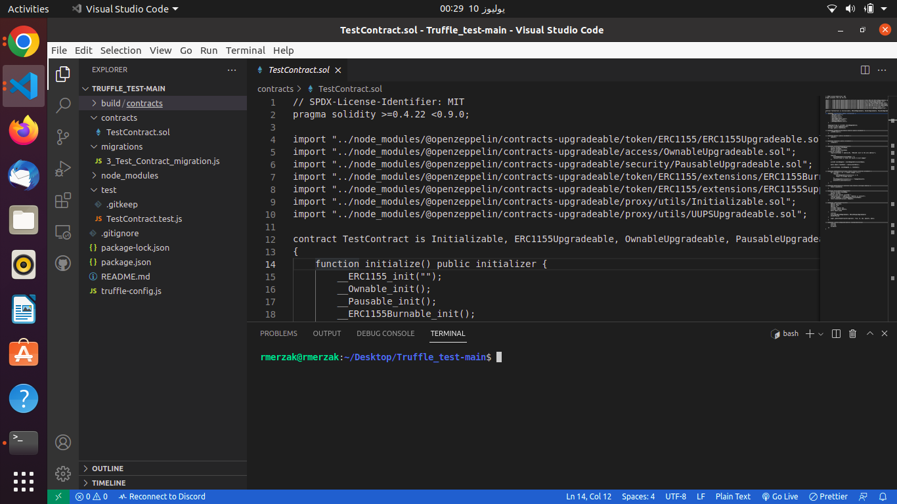
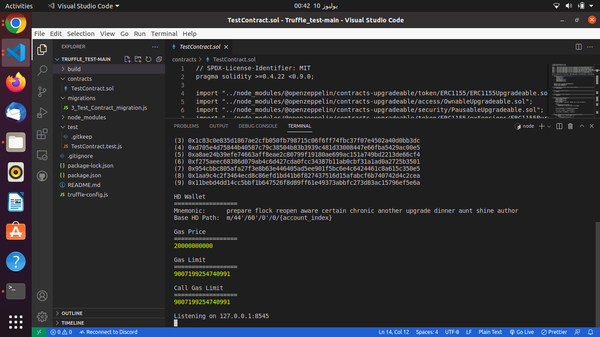
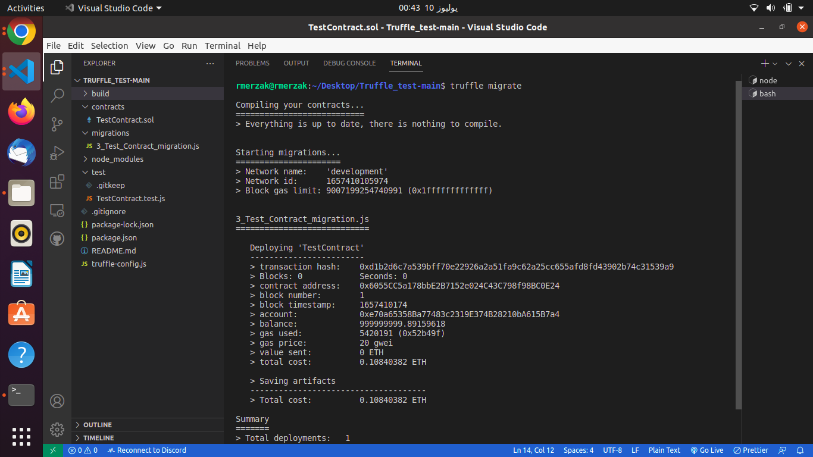

# **solidity**   

<p align="center"></p>  

## introduction:
_everything in Ethereum is just a smart contract_ and the best way to write it is to use Solidity.
Solidity is a brand new programming language native to Ethereum, the second largest cryptocurrency by market capitalization.
Ethereum is not only a cryptocurrency capable of storing value or making payments, but a fully fledged platform for creating what’s known as a smart contract. and the best way to secure your smart contract is to use openzeppelin library.

### openzeppelin:
openzeppelin is a library for secure smart contract development. once is intalled you can use the contracts in the library by importing them.

instalation:
```
npm install -g @openzeppelin\contract
```
security trick: always use codes from the source not from any online web sites.
most of openzeppelin contracts are expected to be used via inheritance.

### TestContract:
this is a smart contract for learning ntf, tokens, security, access control ...
we will use openzeppelin as a library for all the secure function implemented in those secure smart contract in this library.

**used contract**  

1.ERC1155Upgradeable.sol  
2.OwnableUpgradeable.sol  
3.PausableUpgradeable.sol  
4.ERC1155BurnableUpgradeable.sol  
5.ERC1155SupplyUpgradeable.sol  
6.Initializable.sol  
7.UUPSUpgradeable.sol  

Questions:
what is token and what are the diffrent type of token in ethereum?
Access control and ownership?

# **token**  
token is a representation of something in the blockchain.this something can be money,services,...

type of tokens:  
 -fungibles  
 -non-fungibles
 
ERC20: the most widespread token standard for fungible assets, albeit somewhat limited by its simplicity.    
ERC721:  the de-facto solution for non-fungible tokens, often used for collectibles and games.  
ERC777:  a richer standard for fungible tokens, enabling new use cases and building on past learnings. Backwards compatible with ERC20.  
ERC1155: a novel standard for multi-tokens, allowing for a single contract to represent multiple fungible and non-fungible tokens, along with batched operations for increased gas efficiency.


# **Access control and ownership**  

Access control:  
is essential to prevent unauthorized access to critical functions  who is allowed to do this thing, or to mint tokrns, vote on proposals, freeze transfers and many other things. it so important to understand how to implement it or lrt some one steals your whole system.  

ownership:  
define the owner of a contract and do all the administrative tasks on it.  

# **TestContract** :

**Environment preparation**  
Node.js and npm installation:
```sh
node -v
npm -v
```
Truffle installation:
Truffle is a world-class development environment, testing framework and asset pipeline for blockchains using the Ethereum Virtual Machine (EVM).

```sh
npm install -g truffle
```

Ganache installation:
Ganache is a local blockchain network for development purposes. It is convenient to use and it has a friendly interface.
```sh
npm install -g cli-truffle
```
or
```sh
npm install -g truffle
```

```solidity
contract TestContract is
    Initializable,
    ERC1155Upgradeable,
    OwnableUpgradeable,
    PausableUpgradeable,
    ERC1155BurnableUpgradeable,
    ERC1155SupplyUpgradeable,
    UUPSUpgradeable
```
TestContract use all those contract and inherit from them some of there functions in the purpose of securing and writing a good optimized smart contract.

```solidity
function initialize() public initializer {
        __ERC1155_init("");
        __Ownable_init();
        __Pausable_init();
        __ERC1155Burnable_init();
        __ERC1155Supply_init();
        __UUPSUpgradeable_init();
    }
```

this function is an initializer because in the upgradeable smart contract we use init function instead of constructor.  
the constructor is executed when the smart contrqct instance is deployed.but in the proxy-based upgradeability system, it would never happen.that why we use _initializer_. to do so we import contract rom OpenZeppelin Upgrades:
```solidity
import "../node_modules/@openzeppelin/contracts-upgradeable/proxy/utils/Initializable.sol";
```

```solidity
__ERC1155_init("")
```
this function aim to set the URI of the ERC1155 init.
```solidity
__Ownable_init()
```
this line aim to initialize the owner of the contract
```solidity
__Pausable_init()
```
this function allows children to implement an emergency stop mechanism that can be triggered by an authorized account.
```solidity
__ERC1155Burnable_init();
```
this function allow to users to burn there token 
```solidity
__ERC1155Supply_init()
```
to initialise our contract to keep track of totalSupply for ERC1155 tokens
```solidity
__UUPSUpgradeable_init()
```
first what is UUPS proxy pattern:
we need to note that in this case, the word “upgradable” doesn't mean mutable.
The UUPS proxy pattern is similar to the transparent proxy pattern --A proxy with a built in admin and upgrade interface--, except the upgrade is triggered via the logic contract rather than from the proxy contract.
so this function initialise our contract to be upgradable.

```solidity  
mapping(string => uint256) eventBadgeIdStore;
uint256 private badgeIdCounter;
string[] public eventStore;
```
**Mapping**
Mapping is a reference type as arrays and structs. used to store the data in the form of key-value pairs, a key can be any of the built-in data types but reference types are not allowed while the value can be of any type. Mappings are mostly used to associate the unique Ethereum address with the associated value type.
```solidity
mapping(key => value) <access specifier> <name>;
```
in our first variable _eventBadgeIdStore_ a Mapping variable of all the stored event Badge ID where the key is a String and the value is a uint256.
so for every string there is an ID type uint256.


the second variable is a counter for every created Badge in our contract his visibilte is Private where we cannot use this variable outside the contract 

lastly we have an arrays of Strings where we have all the event stored in our contract.

```solidity
function setURI(string memory newuri) public onlyOwner {
        _setURI(newuri);
        }
function pause() public onlyOwner {
        _pause();
    }
function unpause() public onlyOwner {
        _unpause();
    }
```

in those function we use the onlyOwner modifier that makes a function revert if not called by the address registered as the owner. Once you deploy this contract only you or someone that you designate can add new members to the list within. That's it, in a nutshell.
the first function _setURI(string memory newuri)_ is for set token URI which points to metadata about that specific token.
the second function _pause()_ is called by a pauser to pause, triggers stopped state.
but the last one _unpause()_ is called by a pauser to unpause, returns to normal state.

```solidity
function mintEventBadgeAndTransfer(
        string calldata eventName,
        address attendee,
        string calldata eventData
) external onlyOwner {
require(attendee != address(0), "ERC1155: mint to the zero address");
require(eventBadgeIdStore[eventName] > 0, "Invalid event or event not exists to mint badges");
uint256 eventBadgeId = eventBadgeIdStore[eventName];
bytes memory tokenData = (bytes(eventData));
_mint(attendee, eventBadgeId, 1, tokenData);
}
```
**calldata**
special data location that contains the function arguments, only available for external function call parameters.

_mintEventBadgeAndTransfer_ take 3 argument the first one is string calldata eventName, the second one is an address attendee and the last one is a string for the event data. this function is external that meant to be called by other contracts. They cannot be used for internal call.

the purpose for this function is to mint an event Badge if those condition are false **attendee != address(0)** or **eventBadgeIdStore[eventName] > 0** require will throw an error, the rest of the code will not be executed.

```solidity
function addNewEvents(string[] memory events) external onlyOwner {
for (uint256 i = 0; i < events.length; i++) {
	require(eventBadgeIdStore[events[i]] == 0, "Event is already exists");
	eventBadgeIdStore[events[i]] = ++badgeIdCounter;
	eventStore.push(events[i]);
}
}
```

this function aims to add a new Event in our smart contract it is external and only the owner can execute the function. it takes an array of memory events if the event is already exist it throw an error if not it push it on the blockchain.

```solidity
function getAllEvents() external view returns (string[] memory) {
        return eventStore;
    }
```

this function returns an array of STring for all the event Stored in our Smart contract.
```solidity
 function balanceOfEventBadgeToken(
        string calldata eventName,
        address account
    ) external view returns (uint256) {
 require(account != address(0), "address is invalid");
 uint256 badgeId = eventBadgeIdStore[eventName];
 return balanceOf(account, badgeId);
    }
```

this function take a event name and address of an acount on our smart contract and return the balance of this address of the event name.
if the **account != address(0)** it throw an error if not it use _balanceOf(account, badgeId)_ to return the balance of the account for that badgeId.

```solidity
function _beforeTokenTransfer(
        address operator,
        address from,
        address to,
        uint256[] memory ids,
        uint256[] memory amounts,
        bytes memory data
        )internal override(ERC1155Upgradeable, ERC1155SupplyUpgradeable) whenNotPaused
    {
        super._beforeTokenTransfer(operator, from, to, ids, amounts, data);
    }
```
**Hooks:***
Sometimes, in order to extend a parent contract we will need to override multiple related functions, which leads to code duplication and increased likelihood of bugs.
Hooks are simply functions that are called before or after some action takes place. They provide a centralized point to hook into and extend the original behavior.

_beforeTokenTransfer_
this function take 6 arguments three address operator, from and to and 2 uint256[] the ids and amounts also data type of bytes.

we overrided the function in a sub-contract and modifie functionality on our need. This way there's no need to modify the original contract.

Hooks allow us lots of flexibility in modifying the behaviour of a token by allowing us to execute functionality, in this case of the _beforeTokenTransfer_ hook, we can execute functionality before the token is transferred and when in not paused.

```solidity
function _authorizeUpgrade(address newImplementation)
        internal
        override
        onlyOwner
    {}
```

this function is for autorize the new upgrade for our new smart contract we just need to give it the address of the new implementation.


## Application:
after installating and making our environment we got this:

<p align="center"></p>  

first we must run our personal Ethereum blockchain ganache-cli which we can use to run tests, execute commands ..

```shell
ganache-cli --gasLimit=0x1fffffffffffff --allowUnlimitedContractSize -e 1000000000
```
after this commande on our shell we have our test blockchain
<p align="center"></p>  

we must now compile and migrate our contract using truffle:
```shell
truffle compile
```

then
```shell
truffle migrate
```
<p align="center"></p> 

to deploy this smart contract we need **0.10840382 ETH**

## Optimisation:

to optimise the gaz in this smart contract we must find where we have the problem and what are the function that cost alot of gaz and try to minimize them.


.............................................................................................Continue